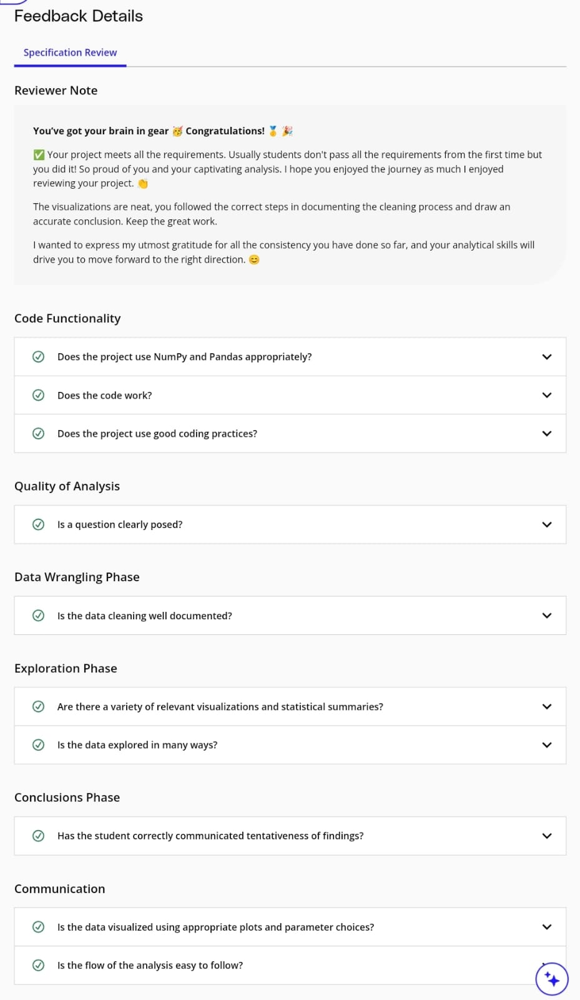

# Udacity Data Analysis Nanodegree  

## Project 1: Investigate a Dataset

## Overview

This project is the first assignment in the **Udacity Data Analysis Nanodegree** program. It investigates a dataset containing information about 10,000 movies collected from The Movie Database (TMDb). The dataset provides insights into various aspects of the film industry, including user ratings, revenue, genres, and cast details.

### Dataset Description

- **Source**: The original dataset is cleaned from Kaggle and is publicly available for research and analysis. You can access the dataset [here](https://www.kaggle.com/tmdb/tmdb-movie-metadata).
- **Contents**: The dataset includes the following key columns:
  - **Movie Title**: The title of the film.
  - **Genres**: The genres associated with each movie, with multiple values separated by pipe (`|`) characters.
  - **Cast**: The cast members of each film, also containing multiple values separated by pipe characters.
  - **User Ratings**: Ratings given by users for each movie.
  - **Budget**: The budget for the movie, adjusted for inflation to reflect 2010 dollars.
  - **Revenue**: The revenue generated by the movie, also adjusted for inflation.

### Notes on the Dataset

- Some columns, particularly **cast** and **genres**, contain multiple values separated by pipe (`|`) characters, indicating the various contributions to each film.
- The **cast** column may include odd characters; however, these should not be cleaned or altered for the purposes of this analysis.
- The final two columns in the dataset that end with “_adj” represent the budget and revenue of the associated movies, adjusted to 2010 dollars to account for inflation over time.

## Example Questions Explored

This analysis addresses several critical questions related to the film industry, including but not limited to:

1. **Which genres have been the most popular over the last 10 years?**
2. **What properties are associated with movies that generate high revenues?**
3. **What is the relationship between movie budget and revenue?**
4. **Does the runtime of a movie impact its revenue generation?**
5. **Is there a correlation between Movie Duration, Popularity, and Revenue?**

## Methodology

The project employs various data analysis techniques, including:

- Data cleaning and preprocessing
- Exploratory data analysis (EDA)
- Visualization of relationships between different variables using scatter plots and regression analysis
- Correlation analysis to identify relationships between key metrics

## Conclusion

The findings from this project provide valuable insights into the film industry, helping filmmakers, marketers, and researchers understand trends in movie popularity, revenue generation, and audience preferences.

## Requirements

To run the analysis, the following libraries are required:

- Pandas
- NumPy
- Matplotlib
- Seaborn

## Specification Review

As part of my project evaluation, I completed a Specification Review, which confirms that all project requirements and expectations have been met. This review demonstrates my adherence to the guidelines and my understanding of data analysis concepts within the context of the TMDb Movie Analysis project.

*The image above showcases the successful completion of the Specification Review for the **Investigate a Dataset Project**, highlighting my proficiency in data analysis and project execution.*
