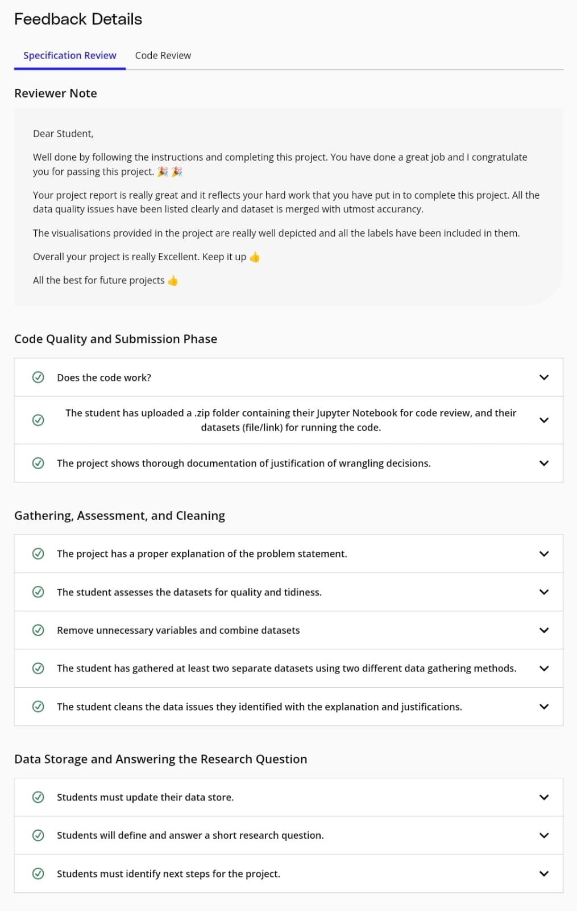

# **Udacity Data Analysis Nanodegree**  

## **Project 2: Analyze Movie Data**

This repository contains **Project 2: Analyze Movie Data** from the **Udacity Data Analysis Nanodegree**. As the second project in the nanodegree, it focuses on exploring movie-related data with a particular emphasis on data wrangling, analysis, and visualization. The project explores key relationships within the data, such as the distribution of genres, budget vs. earnings, and trends in movie ratings. The project culminates in advanced data cleaning techniques and actionable insights that can be drawn from the dataset.

## **Project Files**

This project contains the following key files:

- **README.md**: This file, providing an overview of the project, its goals, key insights, and the necessary instructions to run the analysis.
  
- **requirements.txt**: A file listing the necessary Python dependencies to run the project. This includes libraries such as `pandas`, `seaborn`, `matplotlib`, `numpy`, and `scikit-learn`.
  
- **project_notebook.ipynb**: The main Jupyter notebook for the project, which includes data cleaning, exploratory data analysis (EDA), and visualizations. This notebook demonstrates how the movie data was analyzed and interpreted.

- **Advanced Data Wrangling Project.html**: The exported HTML version of the project notebook, which includes all the analysis, visualizations, and insights from the Jupyter notebook in a web-viewable format.

- **genre.csv**: The raw dataset containing information about movie genres, including genre names and other related attributes.

- **IMDB.csv**: The raw dataset containing information about movie ratings, primarily sourced from IMDb, with details on the movie title, year, rating, and other related attributes.

- **genre_cleaned.csv**: A cleaned version of the `genre.csv` file, where missing values have been handled and any irrelevant or redundant data has been removed for easier analysis.

- **earning_cleaned.csv**: A cleaned version of the `earning.csv` file, where missing or erroneous data points have been addressed and the dataset is ready for analysis on earnings and revenues.

- **imdb_cleaned.csv**: A cleaned version of the `IMDB.csv` file, with necessary adjustments made to ensure consistency in the dataset and to allow for proper analysis.

## **Dataset Description**

The project involves working with three key datasets, each containing critical information about movies:

1. **Genre Dataset (`genre.csv`)**: Contains the genres of different movies and related data.
2. **IMDB Dataset (`IMDB.csv`)**: Contains information about movie ratings, primarily sourced from IMDb.
3. **Earnings Dataset (`earnings.csv`)**: Contains earnings data for various movies, including both domestic and international revenue.

The cleaned versions of these datasets, named `genre_cleaned.csv`, `imdb_cleaned.csv`, and `earning_cleaned.csv`, are used for the analysis.

## **Key Features and Insights**

- **Genre Distribution**: The genre dataset reveals a significant dominance of specific genres such as Drama, Action, and Adventure, which make up the largest portion of the movie industry. This information can help identify audience preferences.

- **Budget and Earnings Correlation**: An analysis of the relationship between movie budgets and earnings shows a strong positive correlation. Movies with larger production budgets tend to generate higher earnings, both domestically and internationally.

- **Ratings Impact on Earnings**: The analysis shows that movie ratings have a moderate correlation with earnings, indicating that ratings do play a role in a movie's commercial success, but other factors such as genre and marketing efforts also contribute significantly.

- **Data Cleaning and Wrangling**: Significant effort was made to clean and preprocess the data, including handling missing values, removing duplicates, and addressing inconsistencies across the datasets. This preparation step ensures the analysis is based on high-quality data.

## **Requirements**

- Python 3.x
- Pandas
- NumPy
- Matplotlib
- Seaborn
- scikit-learn
- Jupyter Notebook

## **Recommendations**

- **Target Popular Genres**: Filmmakers should consider focusing on genres with high demand, such as Drama, Action, and Adventure, which dominate the movie market.

- **Invest in Marketing for High-Budget Films**: Since there is a clear positive correlation between movie budgets and earnings, it's crucial for filmmakers to effectively market their high-budget films to ensure the maximum return on investment.

- **Monitor Ratings for Global Success**: While ratings alone are not a guarantee of success, they can still influence movie earnings. Filmmakers should monitor and optimize ratings, particularly for movies targeting specific audience segments.

## **Conclusion**

This project analyzes and presents actionable insights from the movie dataset, focusing on key relationships such as genre distribution, the impact of budgets on earnings, and the role of movie ratings in commercial success. By focusing on data-driven strategies, filmmakers can improve the profitability and success of their films.

## **Specification Review**

As part of my project evaluation, I completed a Specification Review to confirm that all project requirements and expectations have been met. This review demonstrates my understanding of data analysis concepts, including data wrangling, exploratory data analysis, and visualization, within the context of the **Analyze Movie Data** project.

The image above showcases the successful completion of the Specification Review for the **Real World Data Wrangling with Python** project, highlighting my proficiency in data analysis and project execution.
