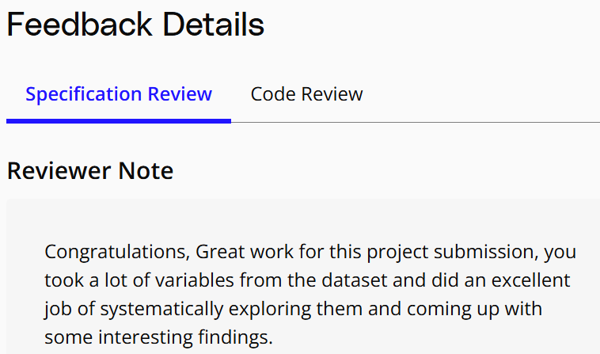

# Udacity Data Analysis Nanodegree  

## Project 3: Communicate Data Findings

This repository contains **Project 3: Communicate Data Findings** from the **Udacity Data Analysis Nanodegree**. As the third project in the nanodegree, it explores sales data with a focus on applying exploratory data analysis (EDA) techniques and visual storytelling to reveal actionable insights. The project builds a structured narrative through visualizations and interpretive commentary, effectively communicating the dataset's story. The dataset used in this analysis was downloaded from the following source: [product_sales.csv](https://s3.amazonaws.com/talent-assets.datacamp.com/product_sales.csv).

## Project Files

This project contains the following key files:

- **Part_I_notebook.ipynb**: A comprehensive exploration of the dataset, covering initial data wrangling and univariate to multivariate analysis. This notebook systematically asks and answers key questions about the dataset, providing initial insights.
- **Part_II_notebook.ipynb**: Extends analysis with in-depth visualizations and storytelling, culminating in a clear narrative of findings that communicate the data insights effectively.
- **data_visualization_functions.py**: A Python file with custom visualization functions for modular and reusable data plotting, enhancing visualization consistency and clarity across the project.
- **requirements.txt**: A file listing the necessary Python dependencies to run the project. This includes libraries such as `pandas`, `seaborn`, `matplotlib`, and `numpy`.
- **product_sales.csv**: The raw dataset containing information about sales methods, products sold, revenue, and customer tenure.
- **cleaned_product_sales.csv**: The cleaned version of the `product_sales.csv` file, with irrelevant data removed and adjustments made for easier analysis.

## Dataset Description

The dataset "product_sales" includes information about sales transactions and customer details, with key attributes such as:
- `revenue`: Total revenue generated from sales
- `nb_sold`: Number of units sold
- `sales_method`: Method used to approach and sell to customers (e.g., Email, Call, Email + Call)
- `customer_id`, `week`: Additional identifiers for tracking customer interactions and weekly trends

## Key Features and Insights

- **Customer Tenure & Loyalty**: The customer base includes both long-term loyal customers and a larger segment of newer customers. Our analysis suggests that enhancing loyalty programs for long-term customers and implementing targeted retention strategies for newer ones could drive sustained growth.
  
- **Sales Methods & Revenue Contribution**: Email dominates in usage and revenue contribution, generating 51.3% of the total revenue. However, combining Email and Call methods yields the highest engagement, contributing 31.3% of revenue. This indicates that an integrated sales strategy is highly effective.

- **Revenue Distribution**: Most sales revenue falls within the $50–$90 range, peaking between $80 and $90. This information can guide pricing and inventory strategies to align with revenue maximization goals.

- **Weekly Revenue Trends**: Over a six-week period, the combined approach of Email + Call consistently outperformed Email alone, highlighting the effectiveness of multi-channel strategies for sustaining growth.

## Requirements

- Python 3.x
- Pandas
- NumPy
- Matplotlib
- Seaborn
- scikit-learn
- Jupyter Notebook

## Recommendations

- **Optimize Email Campaigns**: While Email is the leading sales method, blending Call strategies for personalized follow-ups can enhance customer engagement and sales conversion.
  
- **Targeted Loyalty and Retention Programs**: Focusing on both long-term loyal customers and newer customers with tailored programs can foster loyalty and improve retention rates.

- **Monitor Sales Trends Regularly**: Continuous monitoring will help keep sales strategies relevant, allowing for timely adjustments that capitalize on changing trends.

## Conclusion

This project presents actionable insights into customer segmentation, sales methods, and revenue patterns, offering strategies to improve engagement, retention, and overall sales performance. By focusing on optimizing sales methods, customer loyalty, and pricing strategies, the organization can better sustain growth and meet its revenue targets.

## Specification Review

As part of my project evaluation, I completed a Specification Review, which confirms that all project requirements and expectations have been met. This review demonstrates my adherence to the guidelines and my understanding of data analysis concepts within the context of the **Communicate Data Findings** project.

The image above showcases the successful completion of the Specification Review for the **Communicate Data Findings** project, highlighting my proficiency in data analysis and project execution.
